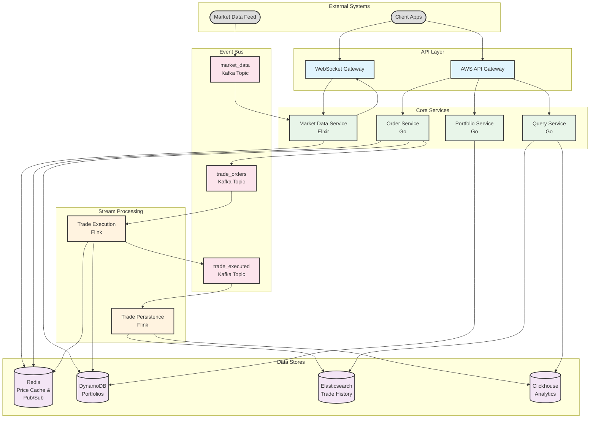

```mermaid
flowchart TB
    subgraph External[External Systems]
        Client([Client Apps])
        MarketFeed([Market Data Feed])
    end

    subgraph Gateway[API Layer]
        APIGW[AWS API Gateway]
        WSGateway[WebSocket Gateway]
    end

    subgraph Services[Core Services]
        direction TB
        OrderSvc[Order Service<br/>Go]
        PortfolioSvc[Portfolio Service<br/>Go]
        QuerySvc[Query Service<br/>Go]
        MarketSvc[Market Data Service<br/>Elixir]
    end

    subgraph Processing[Stream Processing]
        direction LR
        FlinkExec[Trade Execution<br/>Flink]
        FlinkPersist[Trade Persistence<br/>Flink]
    end

    subgraph EventBus[Event Bus]
        direction LR
        KafkaMarket[market_data<br/>Kafka Topic]
        KafkaOrders[trade_orders<br/>Kafka Topic]
        KafkaExec[trade_executed<br/>Kafka Topic]
    end

    subgraph DataStores[Data Stores]
        Redis[(Redis<br/>Price Cache &<br/>Pub/Sub)]
        DynamoDB[(DynamoDB<br/>Portfolios)]
        ES[(Elasticsearch<br/>Trade History)]
        CH[(Clickhouse<br/>Analytics)]
    end

    %% External to Gateway
    Client --> APIGW
    Client --> WSGateway
    MarketFeed --> KafkaMarket

    %% Gateway to Services
    APIGW --> OrderSvc
    APIGW --> PortfolioSvc
    APIGW --> QuerySvc
    WSGateway --> MarketSvc

    %% Market Data Flow
    KafkaMarket --> MarketSvc
    MarketSvc --> Redis
    MarketSvc --> WSGateway

    %% Order Flow
    OrderSvc --> Redis
    OrderSvc --> DynamoDB
    OrderSvc --> KafkaOrders
    KafkaOrders --> FlinkExec
    FlinkExec --> Redis
    FlinkExec --> DynamoDB
    FlinkExec --> KafkaExec

    %% Persistence Flow
    KafkaExec --> FlinkPersist
    FlinkPersist --> ES
    FlinkPersist --> CH

    %% Query Flow
    PortfolioSvc --> DynamoDB
    QuerySvc --> ES
    QuerySvc --> CH

    classDef default fill:#f9f9f9,stroke:#333,stroke-width:2px;
    classDef external fill:#ddd,stroke:#333,stroke-width:2px;
    classDef gateway fill:#e1f5fe,stroke:#333,stroke-width:2px;
    classDef service fill:#e8f5e9,stroke:#333,stroke-width:2px;
    classDef processing fill:#fff3e0,stroke:#333,stroke-width:2px;
    classDef kafka fill:#fce4ec,stroke:#333,stroke-width:2px;
    classDef store fill:#f3e5f5,stroke:#333,stroke-width:2px;

    class Client,MarketFeed external;
    class APIGW,WSGateway gateway;
    class OrderSvc,PortfolioSvc,QuerySvc,MarketSvc service;
    class FlinkExec,FlinkPersist processing;
    class KafkaMarket,KafkaOrders,KafkaExec kafka;
    class Redis,DynamoDB,ES,CH store;
```
