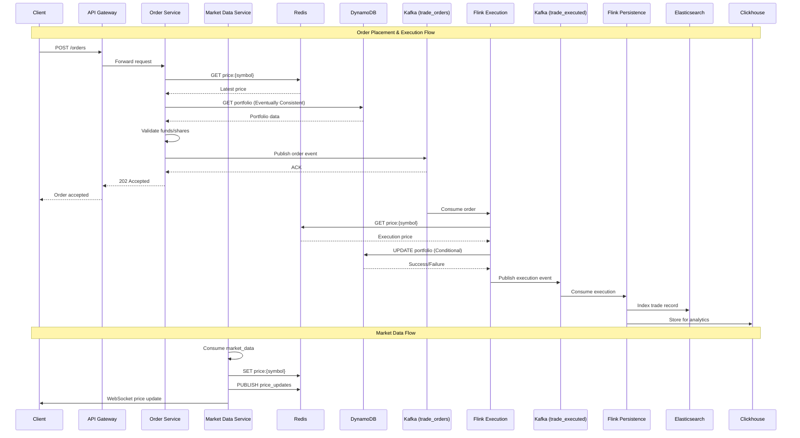

```mermaid
sequenceDiagram
    participant Client
    participant APIGW as API Gateway
    participant OrderSvc as Order Service
    participant MarketSvc as Market Data Service
    participant Redis
    participant DynamoDB
    participant KafkaOrders as Kafka (trade_orders)
    participant FlinkExec as Flink Execution
    participant KafkaExec as Kafka (trade_executed)
    participant FlinkPersist as Flink Persistence
    participant ES as Elasticsearch
    participant CH as Clickhouse

    Note over Client,CH: Order Placement & Execution Flow
    Client->>APIGW: POST /orders
    APIGW->>OrderSvc: Forward request
    OrderSvc->>Redis: GET price:{symbol}
    Redis-->>OrderSvc: Latest price
    OrderSvc->>DynamoDB: GET portfolio (Eventually Consistent)
    DynamoDB-->>OrderSvc: Portfolio data
    OrderSvc->>OrderSvc: Validate funds/shares
    OrderSvc->>KafkaOrders: Publish order event
    KafkaOrders-->>OrderSvc: ACK
    OrderSvc-->>APIGW: 202 Accepted
    APIGW-->>Client: Order accepted

    KafkaOrders->>FlinkExec: Consume order
    FlinkExec->>Redis: GET price:{symbol}
    Redis-->>FlinkExec: Execution price
    FlinkExec->>DynamoDB: UPDATE portfolio (Conditional)
    DynamoDB-->>FlinkExec: Success/Failure
    FlinkExec->>KafkaExec: Publish execution event

    KafkaExec->>FlinkPersist: Consume execution
    FlinkPersist->>ES: Index trade record
    FlinkPersist->>CH: Store for analytics

    Note over Client,CH: Market Data Flow
    MarketSvc->>MarketSvc: Consume market_data
    MarketSvc->>Redis: SET price:{symbol}
    MarketSvc->>Redis: PUBLISH price_updates
    MarketSvc->>Client: WebSocket price update
```
