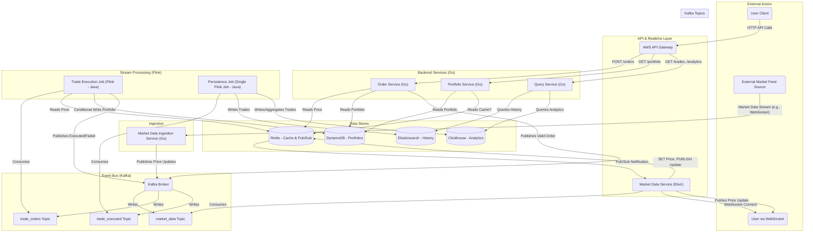

```mermaid
graph TD
    subgraph "External Actors"
        User(User Client)
        WSUser(User via WebSocket)
        ExtFeed(External Market Feed Source)
    end

    subgraph "Ingestion"
        IngestionSvc["Market Data Ingestion Service (Go)"]
    end

    subgraph "API & Realtime Layer"
        APIGW(AWS API Gateway)
        MarketSvc["Market Data Service (Elixir)"]
    end

    subgraph "Backend Services (Go)"
        OrderSvc["Order Service (Go)"]
        PortfolioSvc["Portfolio Service (Go)"]
        QuerySvc["Query Service (Go)"]
    end

    subgraph "Event Bus (Kafka)"
        Kafka(Kafka Broker)
        TopicMarket[market_data Topic]
        TopicOrders[trade_orders Topic]
        TopicExecuted[trade_executed Topic]
    end

    subgraph "Stream Processing (Flink)"
        FlinkExec["Trade Execution Job (Flink - Java)"]
        FlinkPersist["Persistence Job (Single Flink Job - Java)"]
    end

    subgraph "Data Stores"
        DynamoDB[(DynamoDB - Portfolios)]
        Redis[(Redis - Cache & Pub/Sub)]
        Elasticsearch[(Elasticsearch - History)]
        Clickhouse[(Clickhouse - Analytics)]
    end

    %% Data Flows %%

    %% Ingestion Flow
    ExtFeed -- Market Data Stream (e.g., WebSocket) --> IngestionSvc
    IngestionSvc -- Publishes Price Updates --> Kafka -- Writes --> TopicMarket

    %% Realtime Price Flow
    MarketSvc -- Consumes --> TopicMarket
    MarketSvc -- SET Price, PUBLISH Update --> Redis
    MarketSvc -- WebSocket Connect --> WSUser
    Redis -- Pub/Sub Notification --> MarketSvc
    MarketSvc -- Pushes Price Update --> WSUser

    %% User API Flows
    User -- HTTP API Calls --> APIGW
    APIGW -- POST /orders --> OrderSvc
    APIGW -- GET /portfolio --> PortfolioSvc
    APIGW -- GET /trades, /analytics --> QuerySvc

    %% Order Placement Flow
    OrderSvc -- Reads Price --> Redis
    OrderSvc -- Reads Portfolio --> DynamoDB
    OrderSvc -- Publishes Valid Order --> Kafka -- Writes --> TopicOrders

    %% Portfolio Read Flow
    PortfolioSvc -- Reads Portfolio --> DynamoDB
    PortfolioSvc -- Reads Cache? --> Redis

    %% Order Execution Flow
    FlinkExec -- Consumes --> TopicOrders
    FlinkExec -- Reads Price --> Redis
    FlinkExec -- Conditional Write Portfolio --> DynamoDB
    FlinkExec -- Publishes Executed/Failed --> Kafka -- Writes --> TopicExecuted

    %% Persistence Flow
    FlinkPersist -- Consumes --> TopicExecuted
    FlinkPersist -- Writes Trades --> Elasticsearch
    FlinkPersist -- Writes/Aggregates Trades --> Clickhouse

    %% Query Flow
    QuerySvc -- Queries History --> Elasticsearch
    QuerySvc -- Queries Analytics --> Clickhouse

    %% Define Kafka Topic Grouping
    subgraph Kafka Topics
        TopicMarket
        TopicOrders
        TopicExecuted
    end
```
